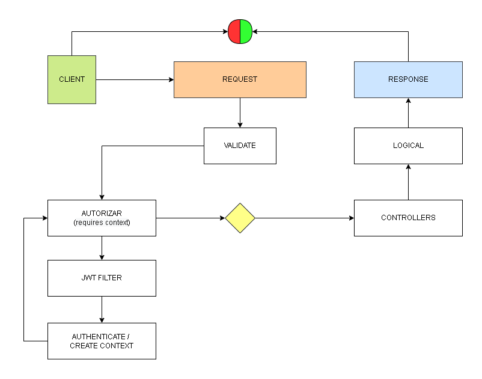
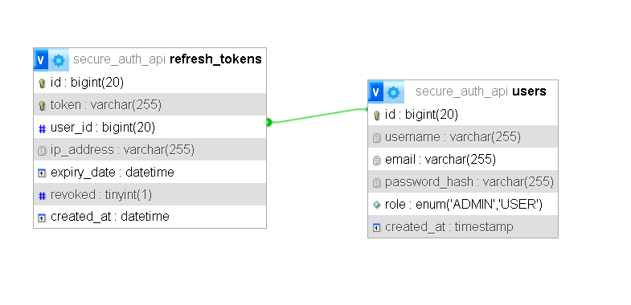

# 🔐 Secure Auth API

Sistema de autenticación moderno desarrollado con **Spring Boot**, basado en arquitectura **stateless**, utilizando **JWT + Refresh Tokens + Roles**.

---

## 🚀 Descripción

Este proyecto implementa un sistema de autenticación completo similar al usado en aplicaciones reales:

* Autenticación con JWT (access token)
* Manejo de sesiones con Refresh Tokens en base de datos
* Autorización basada en roles (USER / ADMIN)
* Arquitectura stateless (sin sesiones del servidor)

---

## 🧠 Problema que resuelve

Los sistemas tradicionales basados en sesiones (`JSESSIONID`) presentan limitaciones:

* No escalan fácilmente
* Difícil control de sesiones activas
* Poca visibilidad de dispositivos conectados

Este proyecto soluciona esto mediante:

✔ Control de sesiones en DB
✔ Revocación de accesos
✔ Soporte multi-dispositivo
✔ Arquitectura escalable

---

## 🏗️ Arquitectura del sistema


---

## 🔄 Flujo de autenticación y autorización



---

## 🗄️ Modelo de base de datos



---

## ⚙️ Tecnologías utilizadas

* Java 17+
* Spring Boot
* Spring Security
* Spring Data JPA
* MySQL
* JWT (Json Web Token)
* BCrypt

---

## 🔐 Arquitectura de autenticación

### 🧩 Flujo general

1. Login con credenciales
2. Generación de:

   * Access Token (JWT)
   * Refresh Token (DB)
3. Validación del JWT en cada request
4. Renovación mediante refresh token

---

## 🔄 Refresh Tokens (sesiones)

Los refresh tokens representan sesiones activas:

* Persisten en base de datos
* Tienen expiración
* Pueden ser revocados
* Permiten múltiples sesiones por usuario

---

## 🛡️ Seguridad implementada

* Hash de contraseñas con BCrypt
* Validación de JWT en cada request
* Autorización por roles
* Revocación de sesiones (logout)
* Rotación de refresh tokens
* Registro de IP por sesión

---

## 📌 Endpoints principales

### 🔐 Auth

* `POST /auth/login`
* `POST /auth/register`
* `POST /auth/refresh`
* `POST /auth/logout`

---

### 🔒 Protegidos

Uso de JWT en header:

```http
Authorization: Bearer <token>
```

---

## 🧪 Ejemplos de uso

<!-- 📌 Insertar aquí screenshots de Postman o requests -->

---

## 📈 Características destacadas

* Arquitectura stateless
* Separación de responsabilidades
* Uso de filtros personalizados (JwtFilter)
* Manejo manual de sesiones (DB)
* Preparado para escalabilidad

---

## ⚠️ Buenas prácticas aplicadas

* No confiar en datos del cliente
* Validación contra base de datos
* Uso de DTOs
* Evitar sesiones del servidor
* Uso correcto de roles (`ROLE_`)

---

## 🚀 Posibles mejoras

* Implementar `UserDetailsService`
* Manejo global de errores (`@ControllerAdvice`)
* Auditoría de acciones
* Registro de dispositivos (User-Agent)
* Dashboard de sesiones activas

---

## 👨‍💻 Autor

Proyecto enfocado en backend moderno, seguridad y arquitectura de autenticación real.

---

## 🧭 Conclusión

Sistema de autenticación completo, seguro y escalable, alineado con prácticas utilizadas en aplicaciones modernas.

---
