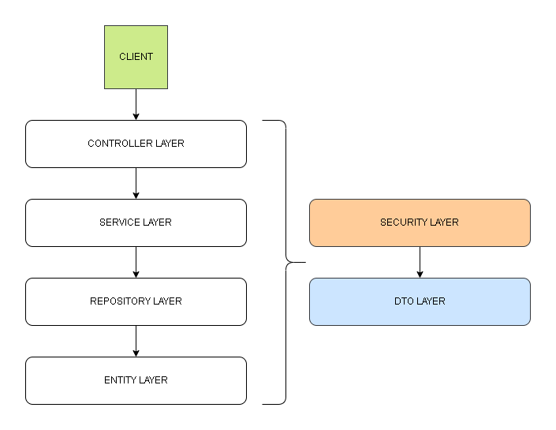
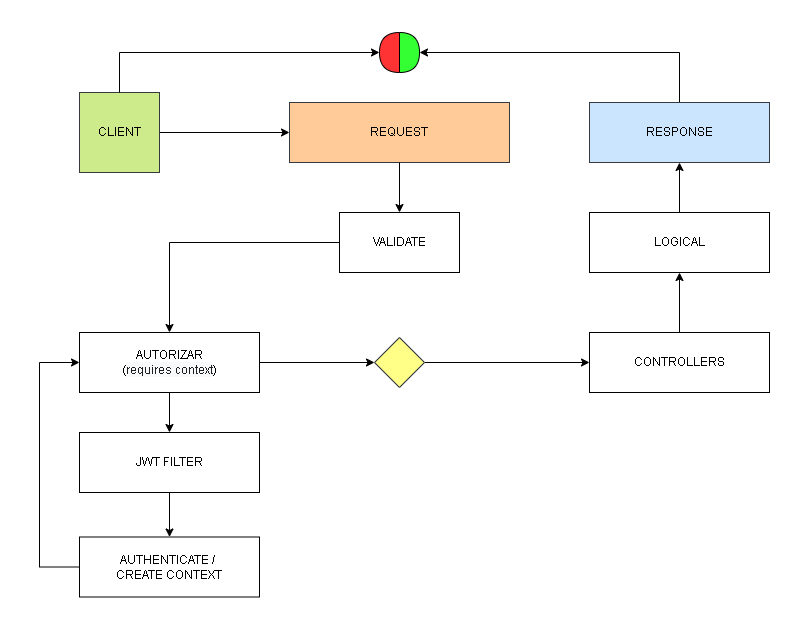
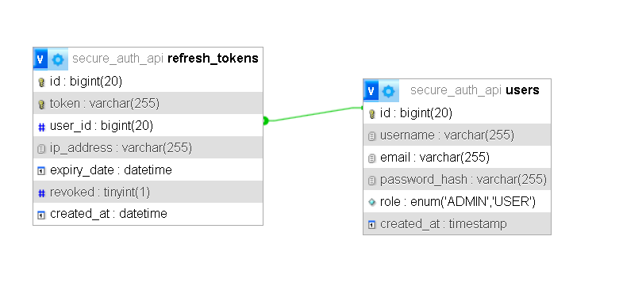
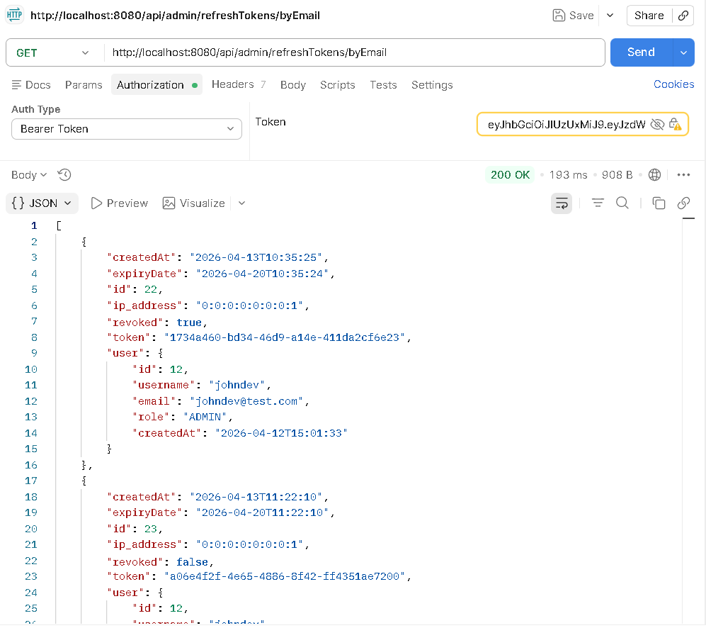
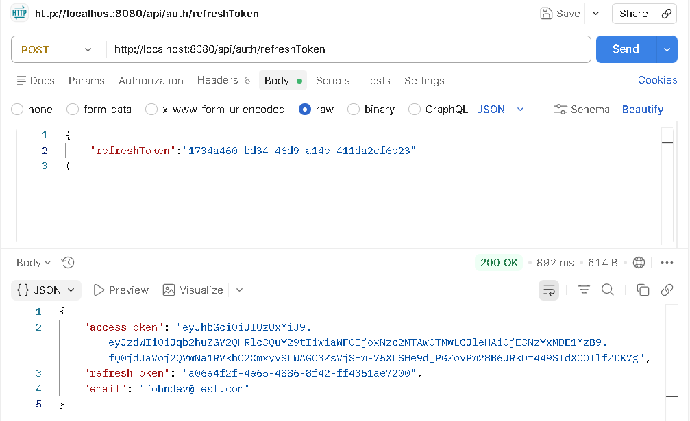

# 🔐 Secure Auth API

A modern authentication system built with **Spring Boot**, based on a **stateless architecture**, using **JWT + Refresh Tokens + Role-Based Authorization**.

---

## 🚀 Overview

This project implements a complete authentication system similar to those used in real-world applications:

* JWT authentication (Access Token)
* Session management with Refresh Tokens stored in a database
* Role-based authorization (USER / ADMIN)
* Stateless architecture (no server-side sessions)

---

## 🧠 Problem It Solves

Traditional session-based authentication (`JSESSIONID`) has several limitations:

* Difficult to scale
* Limited control over active sessions
* Poor visibility of connected devices

This project addresses these issues by providing:

✔ Database-backed session management  
✔ Token revocation  
✔ Multi-device support  
✔ Scalable architecture

---

## 🏗️ System Architecture



---

## 🔄 Authentication & Authorization Flow



---

## 🗄️ Database Model



---

## ⚙️ Technologies Used

* Java 17+
* Spring Boot
* Spring Security
* Spring Data JPA
* MySQL
* JWT (JSON Web Token)
* BCrypt

---

## 🔐 Authentication Architecture

### 🧩 General Flow

1. User logs in with credentials.
2. The system generates:
   * Access Token (JWT)
   * Refresh Token (stored in the database)
3. The JWT is validated on every request.
4. A new Access Token can be issued using the Refresh Token.

---

## 🔄 Refresh Tokens (Sessions)

Refresh Tokens represent active user sessions:

* Stored in the database
* Have an expiration date
* Can be revoked
* Support multiple active sessions per user

---

## 🛡️ Security Features

* Password hashing with BCrypt
* JWT validation on every request
* Role-based authorization
* Session revocation (logout)
* Refresh Token rotation
* IP address logging for each session

---

## 📌 Main Endpoints

### 🔐 Authentication

* `POST /auth/login`
* `POST /auth/register`
* `POST /auth/refresh`
* `POST /auth/logout`

---

### 🔒 Protected Endpoints

JWT must be included in the request header:

```http
Authorization: Bearer <token>
```

---

## 🧪 Usage Examples





---

## 📈 Key Features

* Stateless architecture
* Clear separation of responsibilities
* Custom JWT filter (`JwtFilter`)
* Database-backed session management
* Designed for scalability

---

## ⚠️ Best Practices Applied

* Never trust client-side data
* Validate against the database
* Use DTOs for data transfer
* Avoid server-side sessions
* Proper use of roles (`ROLE_`)

---

## 🚀 Possible Improvements

* Implement `UserDetailsService`
* Global exception handling (`@ControllerAdvice`)
* Audit logging
* Device tracking (User-Agent)
* Active sessions dashboard

---

## 👨‍💻 Author

A backend-focused project centered on modern authentication, security, and scalable architecture.

---

## 🧭 Conclusion

A complete, secure, and scalable authentication system following best practices commonly used in modern backend applications.

---
